# ERD — Servax Bleu (Fase 1, Categorías)

**Estado: 11 de 11 tablas originales con estructura CONFIRMADA** contra `INFORMATION_SCHEMA.COLUMNS` (16/09/2026).
Las 13 tablas de Calidad de Agua y Alimentación v2 (`Sitio`, `Nutriente`, `Sensor`, `LecturaSensorCorral`,
`MuestreoAbiotico`, `MuestreoNutriente`, `EstacionMonitoreo`, `CategoriaFitoplancton`, `MuestreoFitoplancton`,
`MuestreoFitoplanctonCategoria`, `PresentacionAlimento`, `CalculoCargaBarco`, `CalculoCargaBarcoCorral`) están
definidas en `unified_schema.sql` pero **todavía no se confirman contra la BD real**.

## Diagrama

```mermaid
erDiagram
    CORRAL ||--o{ INVENTARIOPEZ : contiene
    CORRAL ||--o{ MUESTREOAGUA : registra
    CORRAL ||--o{ CRECIMIENTOANUAL : mide
    CORRAL ||--o{ REGISTROALIMENTACION : recibe
    CORRAL ||--o{ HISTORIALCORRAL : historia
    CORRAL ||--o{ DISTRIBUCIONALIMENTO : recibe_carnada

    ESPECIE ||--o{ INVENTARIOPEZ : clasifica
    ESPECIE ||--o{ CRECIMIENTOANUAL : clasifica

    ALIMENTO ||--o{ REGISTROALIMENTACION : usado_en
    ALIMENTO ||--o{ DISTRIBUCIONALIMENTO : distribuido_como

    BARCO ||--o{ DISTRIBUCIONALIMENTO : transporta

    SITIO |o--o{ CORRAL : agrupa
    SITIO ||--o{ MUESTREOABIOTICO : monitorea
    SITIO ||--o{ MUESTREOFITOPLANCTON : monitorea
    CORRAL ||--o{ SENSOR : aloja
    CORRAL ||--o{ LECTURASENSORCORRAL : registra_lectura
    SENSOR |o--o{ LECTURASENSORCORRAL : captura
    MUESTREOABIOTICO ||--o{ MUESTREONUTRIENTE : mide
    NUTRIENTE ||--o{ MUESTREONUTRIENTE : catalogo
    ESTACIONMONITOREO ||--o{ MUESTREOFITOPLANCTON : ubica
    MUESTREOFITOPLANCTON ||--o{ MUESTREOFITOPLANCTONCATEGORIA : desglosa
    CATEGORIAFITOPLANCTON ||--o{ MUESTREOFITOPLANCTONCATEGORIA : clasifica
    PRESENTACIONALIMENTO |o--o{ ALIMENTO : presentacion_default
    PRESENTACIONALIMENTO |o--o{ REGISTROALIMENTACION : presentada_como
    PRESENTACIONALIMENTO ||--o{ CALCULOCARGABARCO : presentada_como
    BARCO ||--o{ CALCULOCARGABARCO : carga
    ALIMENTO ||--o{ CALCULOCARGABARCO : carga
    CALCULOCARGABARCO ||--o{ CALCULOCARGABARCOCORRAL : reparte
    CORRAL ||--o{ CALCULOCARGABARCOCORRAL : recibe

    CALIDAD {
        int id PK
        date Fecha
        float Temperatura
        float Oxigeno
        float Profundidad
    }

    CORRAL {
        int IdCorral PK
        int IdSitio FK "nullable"
        varchar Nombre
        varchar Ubicacion
        decimal CapacidadMaxima
        date FechaInstalacion
        varchar Estado
        varchar Observaciones
    }

    ESPECIE {
        int IdEspecie PK
        varchar Nombre
        varchar NombreCientifico
        varchar Tipo
        bit EsToxica
        varchar Descripcion
        bit Activo
    }

    INVENTARIOPEZ {
        int IdInventario PK
        int IdCorral FK
        int IdEspecie FK
        int Cantidad
        decimal PesoPromedioKg
        varchar Estado
        date FechaRegistro
        varchar Observaciones
    }

    MUESTREOAGUA {
        int IdMuestreo PK
        int IdCorral FK
        date Fecha
        float Temperatura
        float Oxigeno
        float Profundidad
        float PH
        float Salinidad
        varchar Nutrientes
        varchar Irregularidad
        varchar Observaciones
    }

    CRECIMIENTOANUAL {
        int IdCrecimiento PK
        int IdCorral FK
        int IdEspecie FK
        int Anio
        decimal PesoPromedioInicial
        decimal PesoPromedioFinal
        float TasaCrecimiento
        varchar Observaciones
    }

    REGISTROALIMENTACION {
        int IdRegistro PK
        int IdCorral FK
        int IdAlimento FK
        int IdPresentacion FK "nullable"
        date Fecha
        decimal CantidadKg
        varchar Responsable
        int Mortalidad
        varchar Observaciones
    }

    ALIMENTO {
        int IdAlimento PK
        int IdPresentacionDefault FK "nullable"
        varchar Nombre
        varchar TipoAlimento
        varchar UnidadMedida
        decimal StockActual
        decimal CostoUnitario
        varchar Observaciones
    }

    BARCO {
        int IdBarco PK
        varchar Nombre
        decimal CapacidadToneladas
        varchar Estado
        date FechaAlta
        varchar Observaciones
    }

    DISTRIBUCIONALIMENTO {
        int IdDistribucion PK
        int IdBarco FK
        int IdAlimento FK
        int IdCorral FK
        datetime Fecha
        decimal CantidadToneladas
        varchar FormulaAplicada
        varchar Observaciones
    }

    HISTORIALCORRAL {
        int IdHistorial PK
        int IdCorral FK
        datetime Fecha
        int CantidadPeces
        varchar EstadoGeneral
        varchar ResumenCalidadAgua
        varchar ResumenNutrientes
        varchar Observaciones
    }

    SITIO {
        int IdSitio PK
        varchar Nombre
    }

    NUTRIENTE {
        int IdNutriente PK
        varchar Nombre
        varchar UnidadMedida
    }

    SENSOR {
        int IdSensor PK
        varchar NumeroSensor
        varchar Marca
        int IdCorral FK
        decimal ProfundidadInstalacion
        bit Activo
    }

    LECTURASENSORCORRAL {
        int IdLectura PK
        int IdCorral FK
        date Fecha
        decimal Profundidad
        varchar MetodoCaptura
        int IdSensor FK "NULL si Manual"
        float Temperatura
        float OxigenoMgL
        float SaturacionOxigenoPct
    }

    MUESTREOABIOTICO {
        int IdMuestreo PK
        int IdSitio FK
        date Fecha
        varchar Turno
        decimal OxigenoDisueltoMgL
        decimal TurbidezM
        varchar Observaciones
    }

    MUESTREONUTRIENTE {
        int IdMuestreo PK, FK
        int IdNutriente PK, FK
        decimal Valor
    }

    ESTACIONMONITOREO {
        int IdEstacion PK
        varchar Nombre "1 a 5 y El Sauzal"
    }

    CATEGORIAFITOPLANCTON {
        int IdCategoria PK
        varchar Nombre
    }

    MUESTREOFITOPLANCTON {
        int IdMuestreoFito PK
        int IdSitio FK
        int IdEstacion FK
        date Fecha
        decimal AbundanciaTotalCelulasL
        varchar Especie
        varchar Observaciones
    }

    MUESTREOFITOPLANCTONCATEGORIA {
        int IdMuestreoFito PK, FK
        int IdCategoria PK, FK
        decimal AbundanciaCelulasL
    }

    PRESENTACIONALIMENTO {
        int IdPresentacion PK
        varchar Nombre
        decimal PesoPromedioPorBolsaKg
    }

    CALCULOCARGABARCO {
        int IdCalculo PK
        int IdBarco FK
        int IdAlimento FK
        int IdPresentacion FK
        date Fecha
        int NumeroBolsas
        varchar Observaciones
    }

    CALCULOCARGABARCOCORRAL {
        int IdCalculo PK, FK
        int IdCorral PK, FK
        decimal ToneladasAsignadas
        varchar ReporteBuceoAjuste
        varchar Observaciones
    }
```

## Notas de diseño

- **`Calidad` no tiene relación FK real con ninguna otra tabla del esquema nuevo.** Es la tabla legacy
  protegida (no se puede modificar su estructura). El monitoreo real por corral vive en `MuestreoAgua`,
  que sí tiene `IdCorral` y las mismas métricas (Temperatura, Oxígeno, Profundidad) más PH, Salinidad,
  Nutrientes e Irregularidad. Considerar si `Calidad` se deprecia a futuro en favor de `MuestreoAgua`
  (pregunta para el cliente, no decisión unilateral del equipo).
- **`DistribucionAlimento`** implementa el RF del cliente "fórmula de distribución de carnada por
  tonelaje según capacidad de barco". `FormulaAplicada` guarda como texto qué regla se usó para esa
  distribución específica (útil para auditar/explicar el cálculo). Como todavía no hay una fórmula de
  negocio confirmada por el cliente, el backend usa un reparto proporcional a `CapacidadToneladas`
  como placeholder — ver `DistribucionAlimentoController.cs`.
- **`HistorialCorral`** es una tabla de snapshot/bitácora: guarda una foto periódica del estado del
  corral (`CantidadPeces`, `EstadoGeneral`, resúmenes de calidad de agua y nutrientes en texto), no un
  registro transaccional como `MuestreoAgua`. Sirve para el RF de "historial de inventario por corral".

- ⚠️ **`EstacionMonitoreo`** es un catálogo de puntos físicos de muestreo de fitoplancton (estaciones 1 a 5
  y "El Sauzal"), **no** temporadas del año. `MuestreoFitoplancton` la referencia por `IdEstacion` (FK
  obligatoria). No se relacionó con `Sitio` porque todavía no está confirmado con el cliente si cada
  estación pertenece a un sitio; `MuestreoFitoplancton` ya guarda el `IdSitio` de cada muestra.
- ⚠️ **`MuestreoAbiotico` + `MuestreoNutriente`** reemplazan el uso de `MuestreoAgua.Nutrientes` (texto libre)
  para la calidad de agua por sitio y turno: 6 nutrientes normalizados vía el catálogo `Nutriente`.
  `LecturaSensorCorral` cubre temperatura/oxígeno por corral y profundidad, distinguiendo `Sensor` vs `Manual`.
- ⚠️ **`MuestreoAgua` sigue en el ERD** porque `HomeController` (dashboard) todavía lo consulta; está por
  decidirse si se depreca a favor de las tablas anteriores.
- Restricciones únicas: `MuestreoAbiotico (IdSitio, Fecha, Turno)` y
  `LecturaSensorCorral (IdCorral, Fecha, Profundidad, MetodoCaptura)`.

## Estado
- Las 11 tablas originales están confirmadas contra la BD real.
- Las 13 tablas nuevas (v2) están definidas en `unified_schema.sql`, pendientes de confirmar con
  `INFORMATION_SCHEMA.COLUMNS` antes de dar el ERD por cerrado.
- Falta pasarlo a un diagrama editable tipo draw.io/Lucidchart para el PDF final.

