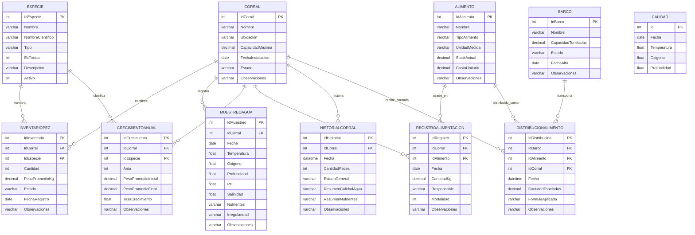

# ERD — Servax Bleu (Fase 1, Categorías)

**Estado: 11 de 11 tablas con estructura CONFIRMADA** contra `INFORMATION_SCHEMA.COLUMNS` (16/09/2026).

## Diagrama

## Notas de diseño

- **`Calidad` no tiene relación FK real con ninguna otra tabla del esquema nuevo.** Es la tabla legacy
  protegida (no se puede modificar su estructura). El monitoreo real por corral vive en `MuestreoAgua`,
  que sí tiene `IdCorral` y las mismas métricas (Temperatura, Oxígeno, Profundidad) más PH, Salinidad,
  Nutrientes e Irregularidad. Considerar si `Calidad` se deprecia a futuro en favor de `MuestreoAgua`
  (pregunta para el cliente, no decisión unilateral del equipo).
- **`DistribucionAlimento`** implementa el RF del cliente "fórmula de distribución de carnada por
  tonelaje según capacidad de barco". `FormulaAplicada` guarda como texto qué regla se usó para esa
  distribución específica (útil para auditar/explicar el cálculo). Como todavía no hay una fórmula de
  negocio confirmada por el cliente, el backend usa un reparto proporcional a `CapacidadToneladas`
  como placeholder — ver `DistribucionAlimentoController.cs`.
- **`HistorialCorral`** es una tabla de snapshot/bitácora: guarda una foto periódica del estado del
  corral (`CantidadPeces`, `EstadoGeneral`, resúmenes de calidad de agua y nutrientes en texto), no un
  registro transaccional como `MuestreoAgua`. Sirve para el RF de "historial de inventario por corral".

## Estado: cerrado ✅
Las 11 tablas están confirmadas. Este ERD ya se puede usar como entregable formal de la Fase 1 del
examen de Arquitectura de la Información (falta pasarlo a un diagrama editable tipo draw.io/Lucidchart
para el PDF final, pero el contenido/relaciones ya están correctos).

