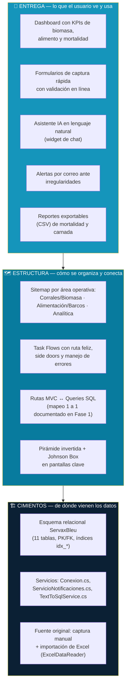

# Fase 5 — Experience Stack (Servax Bleu)

Diagrama conceptual de una sola lámina, en 3 estratos apilados, mostrando cómo
cada capa de Arquitectura de la Información sostiene a la de arriba.

## Lectura del diagrama

- **Cimientos → Estructura:** el esquema de 11 tablas (con sus FK e índices
  `idx_*`) es lo que hace posible que las rutas de Fase 1 tengan una query
  literal detrás de cada una — sin ese esquema, el mapeo ruta→query de
  `Fase1_Navegacion_y_Metadatos.md` no existiría.
- **Estructura → Entrega:** el sitemap agrupado por área operativa (no por
  tabla cruda) es lo que permite que el Dashboard muestre KPIs consolidados
  en vez de una lista de 11 pantallas CRUD sueltas; los Task Flows (Fase 2)
  son los que garantizan que, cuando algo sale mal en la Entrega (SMTP caído,
  IA alucinando), el usuario ve un mensaje claro en vez de un error crudo.
- **Por qué una sola lámina:** el objetivo es poder señalar, frente al
  profesor, cualquier elemento visible en el Dashboard y trazarlo hacia abajo
  hasta la tabla/columna exacta que lo alimenta — es la misma lógica de
  "3 capas" que ya se usa en los wireframes anotados (Fase 3).
